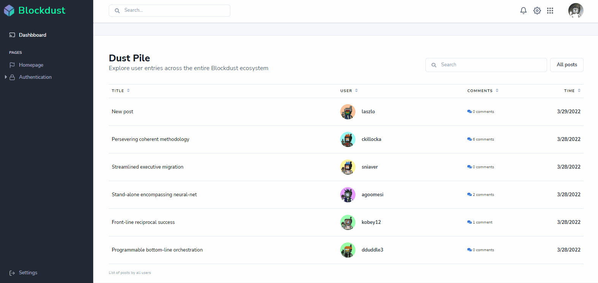

# Blockdust 🧊

A CMS-style Crypto blogging site that follows the MVC paradigm. Handlebars templating, Sequelize ORM, and the express-session NPM package for authentication.

## 📚 Table of Contents

- [Blockdust 🧊](#blockdust-)
  - [📚 Table of Contents](#-table-of-contents)
  - [🧾 Features](#-features)
  - [📖 Developer Journey](#-developer-journey)
  - [🛠️ Installation](#️-installation)
  - [👨‍🏫 Usage](#-usage)
  - [🥂 Credits](#-credits)
  - [👋 How to Contribute](#-how-to-contribute)

## 🧾 Features

- CMS-style blog site for tech writers
- Users can sign-up and publish articles, blog posts, or thoughts and opinions
- "The Dust Pile" Homepage feed with existing blog posts across the ecosystem
- Users who are signed in can post comments
- Dashboard for managing existing posts
- Full CRUD functionality for posts
- Sleek UI for navigation throughout the app
- Deployed to Heroku connected to mySQL database through JawsDB Dyno
- User credentials saved across sessions
- Single post view for blog posts
- Editor view on posts by owner
- Ability to Delete posts as well as logout
- Idle session timeout after set time

## 📖 Developer Journey

📓 This app was created as a site similar to wordpress where developers can spend time reading and writing about technical concepts, recent advancements, and new technologies in Web3. This site was built using a beautiful template called Phoenix based on Bootstrap 5. I chose to forgo the existing webpack workflow in favor of pre-compiling the scss myself in the command line. Beyond that, I used the Sequelize ORM to create models, Mockaroo to generate seed files, and MySQL2 to interact with the database. The entire thing lives inside what's known as the MVC or Model-View-Controller paradigm. The templates are generated from the routing endpoints using the handlebars engine, and the data that displays are based on what is queried from the models. I had an amazing time building this over the last 3 days and I hope to continue this project into the future!

## 🛠️ Installation

Locate the dropdown menu labeled 'Code' to the left of the About section in the main page of this repository. From there, select your preferred cloning method from HTTPS, SSH, or the GitHub CLI. For this demonstration, we will be using the SSH method. Copy the link and head to your terminal. From the command line you should enter:

    git clone <INSERT_SSH_KEY_HERE>

Replacing the above placeholder with the link copied from GitHub. This will clone the repository into a local directory on your machine. And that's it! Happy Hacking! 🚀

## 👨‍🏫 Usage

This code is strictly for use by the crypto hood bugs, rug pullers, and defi-degens of the blocksphere and is only provided as material for study and otherwise double-checking implementation of various server-side and back-end functionality such as but not limited to the MVC paradigm, Handlebars, express servers, node module exports, the Sequelize ORM tool, MySQL database queries, Content Management Systems, Insomnia implementatons, routing, seed files, schema and other dusty stuff. Any violations of these use cases will see the offender mined in the next transaction and subject to an outrageous gas fee.

Link to walkthrough video included below.

## 🥂 Credits

UT Austin Coding Boot Camp https://techbootcamps.utexas.edu/coding/

Kyle Ferguson https://github.com/kferguson52

Stack Overflow https://stackoverflow.com/

MDN Web Docs https://developer.mozilla.org/en-US/

## 👋 How to Contribute

See the [Contributor Covenant](https://www.contributor-covenant.org/) for details on how to contribute
